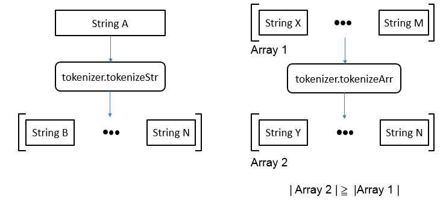
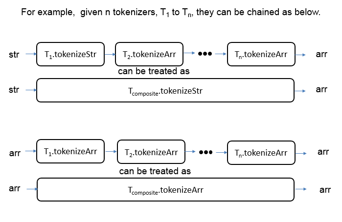

.. _extractor:

Extractor
=========

Extractor is a tool that extracts URIs from a given RDF file, and then turns these URIs into query terms. The purpose of Extractor is to find URI that cannot be reached in the given RDF. These URIs are usually generated by typical format translators and violate linked data design rules proposed by Tim Berners-Lee, i.e., they cannot be looked up in the Web. By generating query terms for them, other X2R tools, USS and UMS, can help in finding or minting better URIs.

RDF is comprised of three types of nodes: URI references, blank nodes or literals. 

Input/Output
------------

**Input**: RDFGraph

**Output**: *X2R data exchange format*

Components of X2R share a common data exchange format: *X2R data exchange format*. The output of Extractor is in the foramt of X2R data exchange format. The detail spec. of this exchange format is described below. Note that the "replacedURI" name/value pair is intentionally left blank in the context of Extractor (the potential replacedURI is obtained in the context of USS, and is applied in the context of Mapper). 

.. code-block:: json

 { "metadata": [],
   "mapping": 
     [
         {
          "status": value of status,
          "originalURI": value of original URI, 
          "replacedURI": value of updated URI, 
          "term": value of term
          }
     ]
  }

===========  ==================================================
name         value range/format
===========  ==================================================
status       Range: {"N/A", "200", "303", "error"}
originalURI  A URI that can be found in input file and is valid
replacedURI  A valid URI
term         A string
===========  ==================================================

Major components
^^^^^^^^^^^^^^^^

**RDFGraph**

Accept *one element of ["json", "ntriples", "turtle", "rdfxml", "n3", "rdfa", "guess"]* and *string in a RDF serialization format*

Extractor accepts RDF in the data structure of RDFGraph. RDFGraph is the internal data structure used to abstract RDF attributes and operations. Using RDFGraph also make Extractor independent from the diversity of RDF serialization formats. Currently RDFGraph accepts a subset of RDF serialization formats. To initialize a RDFGraph object, user should specify the input format in terms of "value" listed in the Table below. If users have no idea of what the format of input is, they can use the "guess" value to ask Extractor to recognize the input's format for them (if it is one of the supported format list).    

======== =========== =================================================
value    name        reference
======== =========== =================================================
json     RDF/JSON    http://n2.talis.com/wiki/RDF_JSON_Specification
ntriples N-Triples   http://www.w3.org/TR/n-triples/
turtle   Turtle      http://www.dajobe.org/2004/01/turtle
rdfxml   RDF/XML     http://www.w3.org/TR/rdf-syntax-grammar
n3       N3          http://www.w3.org/2000/10/swap/grammar/n3
rdfa     RDFa        http://www.w3.org/TR/rdfa-core/
guess                If user don't know the format
======== =========== =================================================

**Tokenizer** is a major component of extractor. It aims to tokenize the tail of extracted URIs into word chuncks that can then be used as query terms to find better URIs.  

In X2R Extractor, a tokenizer should implement two methods, tokenizeArr(array $arr) and tokenizeStr($str). 

     This is the caption of the figure (a simple paragraph).

     This is the caption of the figure (a simple paragraph). 

X2R currently support two tokenizers, delimited-based tokenizer and cased-based tokenizer.

Web API Definition
^^^^^^^^^^^^^^^^^^^

.. http:post:: /extractor{?excludedNamespaces, checkUrisStatus, rdfContent}

        

   :query excludedNamespaces: *(optional)* This specifies a list of namespaces to be skipped. That is, if a found URI belonged to this list, the URI will not be processed anymore.   
   :query checkUrisStatus: *(required)* This determines if `extractor` checks the status codes of found URIs. 
   :query rdfContent: *(required)* This specifies the content of RDF to be processed. 
   :resheader Content-Type: application/json
   :statuscode 200: no error
   :statuscode 404: exception
   
 

Response Format Detail
**********************

Content-Type: application/json

Response template::

    {"metadata": [],
     "mapping": 
                 [{"status": "", 
                   "originalURI": "", 
                   "replacedURI": "", 
                   "term": "", 
                   "lineNumbers": ""
                  }
                 ]
    }

Mapping entry::

                 [{"status": "", 
                   "originalURI": "", 
                   "replacedURI": "", 
                   "term": ""
                  }
                 ]    

Examples
^^^^^^^^

   Here provides three examples of requesting Extractor Web service. Example 1 is a request without excludeNamespaces. In that case, Extractor will return all URIs found in given rdfContent with their corresponding terms. Example 2 illustrates the case of using excludeNamespaces to ignore URIs that are belonged to trustable namespaces, such as "http://www.w3c.org". Example 3 demos the usage of checkUrisStatus. Depending on the value of checkUrisStatus, "on" will let Extractor test the connection to extracted URI and get the response's status code. In the context of X2R, only two codes, "200" and "303", are valid. For status code other than 200 and 303, Extractor returns "error". The connection test will cause additional delay to Extractor services. For users who need instant response, setting checkUrisStatus as "off" can save waiting time.    

   **Example 1 request**:

   .. sourcecode:: http

      POST /extractor?rdfContent=input_value HTTP/1.1

   *input_value*:
       .. sourcecode:: http

           <?xml version="1.0" encoding="UTF-8"?>
               <rdf:RDF
                   xmlns:rdfs="http://www.w3.org/2000/01/rdf-schema#"
                   xmlns:geo="http://www.w3.org/2003/01/geo/wgs84_pos#"
                   xmlns:xsd="http://www.w3.org/2001/XMLSchema#"
                   xmlns:rdf="http://www.w3.org/1999/02/22-rdf-syntax-ns#">

           <rdf:Description rdf:about="http://127.0.0.1/DaTongSportsCenter">
               <rdf:type rdf:resource="http://www.w3.org/2003/01/geo/wgs84_pos#SpatialThing"/>
               <updatedAt xmlns="http://openisdm.iis.sinica.edu.tw/VR/" 
                   rdf:datatype="http://www.w3.org/2001/XMLSchema#dateTime">2013-07-31T03:23:47Z</updatedAt>
               <geo:long>121.516</geo:long>
               <hasTelephone xmlns="http://openisdm.iis.sinica.edu.tw/VR/">2592-0055</hasTelephone>
               <hasName xmlns="http://openisdm.iis.sinica.edu.tw/VR/">Da Tong Sports Center</hasName>
               <geo:location>No.51, Dalong St., Datong Dist., Taipei City 103, Taiwan (R.O.C.)</geo:location>
               <usedFor xmlns="http://openisdm.iis.sinica.edu.tw/VR/">Sport</usedFor>
               <createdAt xmlns="http://openisdm.iis.sinica.edu.tw/VR/" 
                   rdf:datatype="http://www.w3.org/2001/XMLSchema#dateTime">2012-11-28T09:05:13Z</createdAt>
               <geo:lat>25.0648</geo:lat>
           </rdf:Description>

          <rdf:Description rdf:about="http://127.0.0.1/ShilinSportsCenter">
            <rdf:type rdf:resource="http://www.w3.org/2003/01/geo/wgs84_pos#SpatialThing"/>
            <updatedAt xmlns="http://openisdm.iis.sinica.edu.tw/VR/" 
                rdf:datatype="http://www.w3.org/2001/XMLSchema#dateTime">2013-07-31T03:23:47Z</updatedAt>
            <geo:long>121.521</geo:long>
            <hasTelephone xmlns="http://openisdm.iis.sinica.edu.tw/VR/">2880-6066</hasTelephone>
            <hasName xmlns="http://openisdm.iis.sinica.edu.tw/VR/">Shilin Sports Center</hasName>
            <geo:location>No.1, Shishang Rd., Shilin Dist., Taipei City 111, Taiwan (R.O.C.)</geo:location>
            <usedFor xmlns="http://openisdm.iis.sinica.edu.tw/VR/">Sport</usedFor>
            <createdAt xmlns="http://openisdm.iis.sinica.edu.tw/VR/" 
                rdf:datatype="http://www.w3.org/2001/XMLSchema#dateTime">2012-11-28T09:05:13Z</createdAt>
            <geo:lat>25.0897</geo:lat>
          </rdf:Description>

           </rdf:RDF>
    
   **Example 1 response**:

   .. sourcecode:: json

      HTTP/1.1 200 OK
      Vary: Accept
      Content-Type: application/json

      {
      "metadata":[
      ],
      "mapping":[
      {
      "status":"N/A",
      "originalURI":"http://127.0.0.1/DaTongSportsCenter",
      "replacedURI":"",
      "term":" Da Tong Sports Center "     
      },
      {
      "status":"N/A",
      "originalURI":"http://www.w3.org/1999/02/22-rdf-syntax-ns#type",
      "replacedURI":"",
      "term":" 22 rdf syntax ns type "      
      },
      {
      "status":"N/A",
      "originalURI":"http://openisdm.iis.sinica.edu.tw/VR/updatedAt",
      "replacedURI":"",
      "term":" updated At "     
      },
      {
      "status":"N/A",
      "originalURI":"http://www.w3.org/2003/01/geo/wgs84_pos#long",
      "replacedURI":"",
      "term":" wgs84 pos long "     
      },
      {
      "status":"N/A",
      "originalURI":"http://openisdm.iis.sinica.edu.tw/VR/hasTelephone",
      "replacedURI":"",
      "term":" has Telephone "       
      },
      {
      "status":"N/A",
      "originalURI":"http://openisdm.iis.sinica.edu.tw/VR/hasName",
      "replacedURI":"",
      "term":" has Name "       
      },
      {
      "status":"N/A",
      "originalURI":"http://www.w3.org/2003/01/geo/wgs84_pos#location",
      "replacedURI":"",
      "term":" wgs84 pos location "       
      },
      {
      "status":"N/A",
      "originalURI":"http://openisdm.iis.sinica.edu.tw/VR/usedFor",
      "replacedURI":"",
      "term":" used For "       
      },
      {
      "status":"N/A",
      "originalURI":"http://openisdm.iis.sinica.edu.tw/VR/createdAt",
      "replacedURI":"",
      "term":" created At "      
      },
      {
      "status":"N/A",
      "originalURI":"http://www.w3.org/2003/01/geo/wgs84_pos#lat",
      "replacedURI":"",
      "term":" wgs84 pos lat "      
      },
      {
      "status":"N/A",
      "originalURI":"http://127.0.0.1/ShilinSportsCenter",
      "replacedURI":"",
      "term":" Shilin Sports Center " 
      }
      ]
      }

   **Example 2 request**:

   .. sourcecode:: http

      POST /extractor?excludedNamespaces[]&rdfContent=input_value HTTP/1.1

   *excludedNamespaces[]*

   .. sourcecode:: http
 
      excludedNamespaces[]=www.w3.org&excludedNamespaces[]=openisdm.iis.sinica.edu.tw

   *input_value* is the same as Example 1's erquest.

    
   **Example 2 response**:

   .. sourcecode:: json

      HTTP/1.1 200 OK
      Vary: Accept
      Content-Type: application/json

      {
      "metadata":[
      ],
      "mapping":[
      {
      "status":"N/A",
      "originalURI":"http://127.0.0.1/DaTongSportsCenter",
      "replacedURI":"",
      "term":" Da Tong Sports Center "     
      },
      {
      "status":"N/A",
      "originalURI":"http://127.0.0.1/ShilinSportsCenter",
      "replacedURI":"",
      "term":" Shilin Sports Center " 
      }
      ]
      }

   **Example 3 request**:

   .. sourcecode:: http

      POST /extractor?excludedNamespaces[]&rdfContent=input_value&checkUrisStatus=on HTTP/1.1

   *excludedNamespaces[]* is the same as Example 2's request. 

   *input_value* is the same as Example 1's request.

    
   **Example 3 response**:

   .. sourcecode:: json

      HTTP/1.1 200 OK
      Vary: Accept
      Content-Type: application/json

      {
      "metadata":[
      ],
      "mapping":[
      {
      "status":"error",
      "originalURI":"http://127.0.0.1/DaTongSportsCenter",
      "replacedURI":"",
      "term":" Da Tong Sports Center "     
      },
      {
      "status":"error",
      "originalURI":"http://127.0.0.1/ShilinSportsCenter",
      "replacedURI":"",
      "term":" Shilin Sports Center " 
      }
      ]
      }
