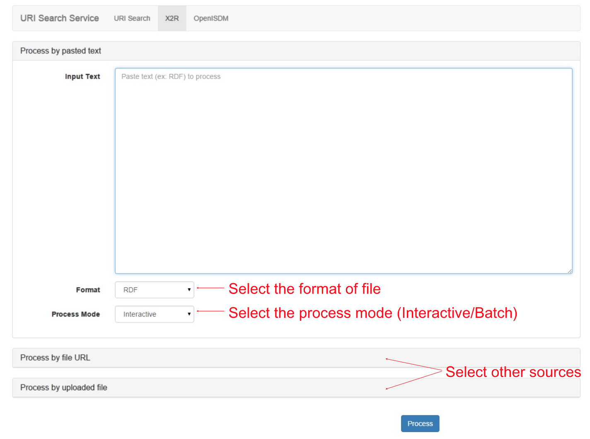
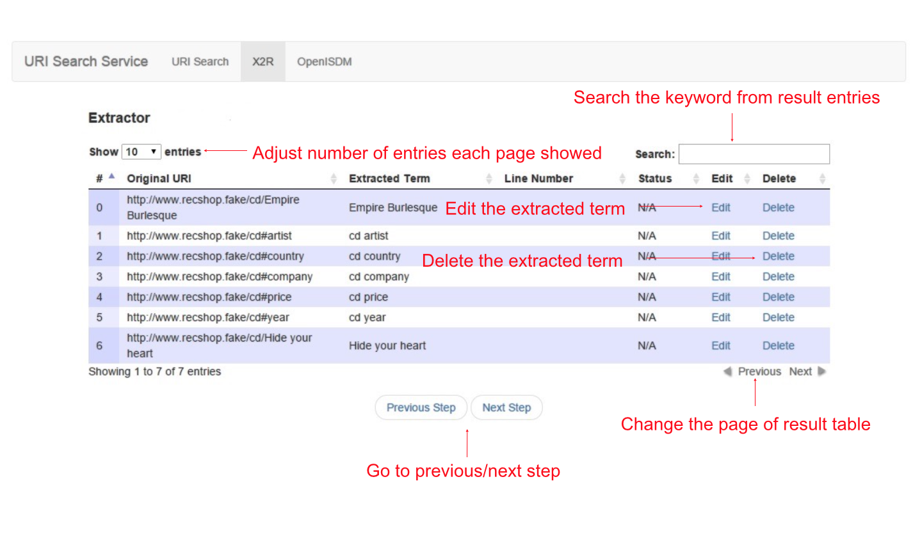

.. _uss:

URI Search Service
==================

URI Search Service (USS) is a federated search service. The general process of USS is listed below. 

#. USS accepts a set of URI search requests 
#. USS refines the search requests (e.g. fixing typos or replace with a better term)
#. USS composes corresponding SPARQL for each query request
#. USS issues SPARQL queries to a set of Endpoints, which are defined in USS's configuration

#. USS integrates all results returned from Endpoints

#. USS applies filters and rankers to remove the ambiguity or promote results that are commonly used

#. USS selects one result for each request

All steps listed above should be easily replacable. These steps can also be outsourced to human instead of heuristics. In order to make USS a flexible system, we provide the system with the following useful hooks. These hooks can be replaced or extended independly. These atomic hooks can also be composited through method chaining.    

In refined USS, seven **atomic hooks** can be replaced and extended, they are: 

* **Query Parser** - Query Parser parses the plain text query string into set of query terms, term refinement qualifiers, result set qualifiers and corresponding integration commands.

* **Federated Search** - Federated Search is a container of implemented Endpoint instances. By containing Endpoint instances, query issued to Federated Search can be federatedly issued to all its contained Endpoint instances, and the results from contained Endpoint instances will be aggregated and returned as one result set.
  
.. _Endpoint:
* **Endpoint** (see also: :php:class:`Endpoint`) - Endpoint wraps a public endpoint, such as DBpedia, and handles the errors, such as Endpoint service downtime. Endpoint accepts SQARQL query and return the result set in the standard format of Endpoint. 

* **Term Refiner** - Term Refiner takes one query term as its input and produces as output a refined query term.  

* **Result Ranker** - Result Ranker reorders the ranks of result set based on the heuristic that it wants to realize. In addition to an extensible set of heuristics, Result Ranker can also be a crowdsourcing task, which can be delegated to the crowd. 

* **Result Filter** - Result Filter augments USS's ability in selectively reducing the size of result set of possible URIs. It filters result set by a regular expression patterns. The typical usage of Result Filter is to resolve ambiguity by excluding URIs that have the desciptions matched the defined regular expression patterns.  

..  (Term filters: filter some terms) Result Filter takes two input parameters: the filtered size and the result set. The filtered size, which determine the size of returned result set, sholud be larger than zero. The first ''filtered size'' results will be returned as the filtered result set. 

* **Result Integrator** - Result Integrator takes two or more result sets and integrates them as one ranked result set. 

* **Result Selector** - Result Selector is an abstract class defined a common interface for the task of picking one fittest URI from a set of possible URIs returned from existing Endpoints. The task can be either automatic doned by programmed heuristics or a crowdsourcing task that can be accomplished by poping up a user interface for real human to select the fittest URI.   

  

Web API Definition
^^^^^^^

.. http:get:: /uss{?q, sites, output, start, num}

   :query q: *(required)* Search term of interest.
   :query sites: *(required)* The sites to search term. Has default value.
   :query format: *(required)* The format of returned result. 
   :query start: *(optional)* The offset to specify the index of returned result.
   :query num: *(optional)* The number of returned result. Use with start in the search query.
   :resheader Content-Type: application/json
   :statuscode 200: no error
   :statuscode 404: exception

Response template:

.. sourcecode:: json

  {
   “term”:”typhoon”,
   “data”:[array of searched URI results]
  }

Data entry:

.. sourcecode:: json

  "data": [
   {
    "dataSourceName": "http://dbpedia.org",
    "response": {
     "head": {
      "link": [],
      "vars": [
       "s",
       "o"
      ]
     },
     "results": {objects of returned URI results}
     }
  }
  ]

Result entry

.. sourcecode:: json

  "results": {
      "distinct": false,
      "ordered": true,
      "bindings": [
       {
        "s": {
         "type": "uri",
         "value": "http://wikidata.dbpedia.org/uri_1"
        },
        "o": {
         "type": "literal",
         "xml:lang": "en",
         "value": "typhoon"
        }
       }
     ]
  }

Example
^^^^^^^

**Example request:**

 .. sourcecode:: http

    GET /uss?q=typhoon&sites&output=json

**Example response:**

.. sourcecode:: json

  {
   "term": "typhoon",
   "data": [
   {
    "dataSourceName": "http://dbpedia.org",
    "response": {
     "head": {
      "link": [],
      "vars": [
       "s",
       "o"
      ]
     },
     "results": {
      "distinct": false,
      "ordered": true,
      "bindings": [
       {
        "s": {
         "type": "uri",
         "value": "http://wikidata.dbpedia.org/uri_1"
        },
        "o": {
         "type": "literal",
         "xml:lang": "en",
         "value": "typhoon"
        }
       },
       {
        "s": {
         "type": "uri",
         "value": "http://dbpedia.org/resource/uri_2"
        },
        "o": {
         "type": "literal",
         "xml:lang": "en",
         "value": "Typhoon shelters in Hong Kong"
        }
       }                        
      ]
     }
    }
   }
  ]
  } 

**Two more request/response examples (With default ResultRanker) **

 .. sourcecode:: http

    GET /uss?q=typhoon&sites&output=json

 #. This request returns the results that match the search query terms "typhoon" AND "weather" from "http://dbpedia.org/sparql".

 #. Example 2: This request returns the results that match the search query terms "country" from "http://dbpedia.org/sparql" and "http://linkedgeodata.org/sparql". 

     u.

     e.

.. figure:: ./figs/uss_mapper.PNG
     :scale: 80%
     :alt: test

     m.

.. figure:: ./figs/uss_format
     :scale: 80%
     :alt: test

     f.

