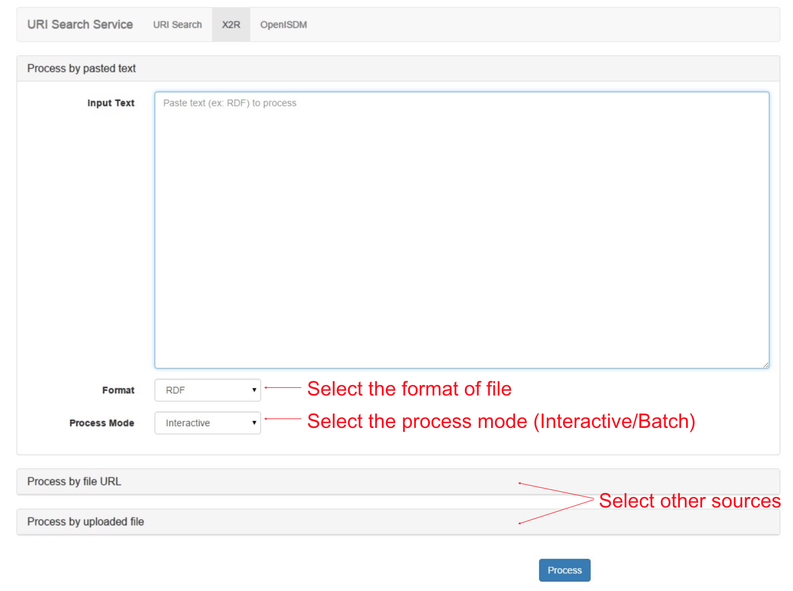

.. _x2r:

X2R User Interface
==================

X2R is designed to be both human and machine friendly through an open API. 
Based on the API, the tool aims to provide two kinds of user interfaces for human users:
a Web-based GUI and a command line Interface.
 

API Usage
------------------

The details of API usage can be found in next chapter.

User Interface
---------------

X2R 1.0 provides a JQuery-powered GUI and a command line Interface is planned to be included in version 2.0. 

     User of X2R GUI first inputs RDF file. X2R GUI provides three input methods, input through text, input through a URL or input through a file. The default method is input through text, user can change to other two methods by clicking (marked in red words "Select other sources"). After input text, user needs to specify the RDF serialization format's type (marked in red words "Select the format of file") through a dropdown menu. There are two modes provided by X2R GUI, interactive and batch. User can specify the mode through a dropdown menu (marked in red words "Select the process mode (Interactive/Batch)"). For large RDF file, batch mode is more feasible than interactive mode, the implemented heuristics will automatically select terms, find URIs and replace URIs as an improved RDF file. For small to medium size RDF files that translated from raw data with meaningless data namings, interactive mode might be a better choice. If the user selects the batch mode, user will skip next two screenshots and follow by the forth screenshot.  

.. figure:: ./figs/uss_extractor.PNG
     :scale: 80%
     :alt: test

     After inputting the RDF, the control is handed over to Extractor. This screenshot depicted the GUI of Extractor. There is a table that lists the extracted URIs found in the inputted RDF with the automatically tokenized terms. If the automatically tokenized terms are not representive enougth, user can use the "edit" or "delete" buttons located in the end of each row to edit or delete the terms. GUI of Extractor provides a result size selector, and user can select the number of results showed per page. 

     After confirming or editing the extracted terms, X2R GUI helps user to issue the terms to endpoints supported by X2R GUI. Currently, X2R supports two endpoints, Dbpedia and LinkedGeoData. User can select one of the URI result list to replace original URI by clicking "Replace" botton. To switch to other term's URI list, user can click the "Next Term" tab to switch.   

     After replacing URI interactivelly or automatically, user can select the RDF serialization format for the updated RDF. The RDF serialization formats listed below are supported X2R 1.0.  

======== =========== =================================================
json     RDF/JSON    http://n2.talis.com/wiki/RDF_JSON_Specification
ntriples N-Triples   http://www.w3.org/TR/n-triples/
turtle   Turtle      http://www.dajobe.org/2004/01/turtle
rdfxml   RDF/XML     http://www.w3.org/TR/rdf-syntax-grammar
n3       N3          http://www.w3.org/2000/10/swap/grammar/n3
rdfa     RDFa        http://www.w3.org/TR/rdfa-core/
======== =========== =================================================

